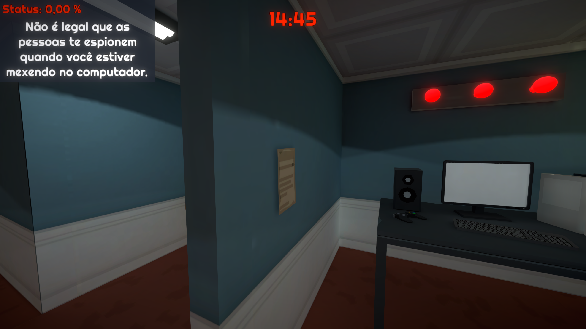
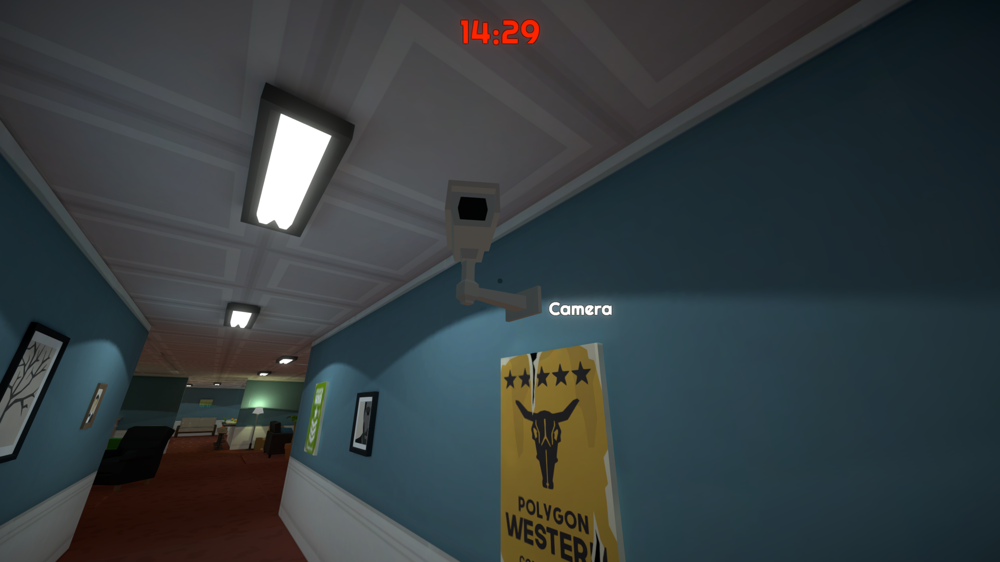

# Unity_EscapeRoomGame

## FPS Escape Room Game!

Development Status: <strong> Playable to end! </strong>

### Developement info:
Started development in Unity <strong>2019.4</strong> using URP <strong> v10.4.0. </strong>  
Migrated to Unity <strong>2020.3.5f1</strong> due to a bug in that didn't let me bake lights with my video card!  
Development time: 5 days.  

### Assets Used:  

- POLYGON Town Pack - Low Poly 3D Art by Synty  
https://assetstore.unity.com/packages/3d/environments/urban/polygon-town-pack-low-poly-3d-art-by-synty-121115  

- Clean Flat Icons  
https://assetstore.unity.com/packages/2d/gui/icons/clean-flat-icons-98117  

- LeanTween  
https://assetstore.unity.com/packages/tools/animation/leantween-3595  

### How to Install:

Works on (PC Windows)  
Available Languages: <strong>English, Portuguese </strong> 

Download .rar file inside "BuildGame/WindowsBuild", place in desired folder on your machine. Unzip and launch "Escape Room.exe". You can send the icon to your desktop if you want too.  

### How to play:

<strong> WASD:</strong> To move   
<strong> Mouse: </strong> Move Camera  
<strong> Mouse Click: </strong> Interact  
<strong> Mouse Hold: </strong> Grab itens  

## Gameplay screenshot!

   . 
   . 
   . 
   . 
   . 

# <strong> Puzzle Solutions (SPOILERS)! </strong>

## Basket Puzzle!

- In this puzzle there are 4 itens that need to be thrown through!

### Football in parents bedroom!

### Soccerball in PC room!

### Burger in the kitchen (There's a note that hints this)!

### Frisbee in the kitchen!

## Computer Puzzle!

- In this puzzle you have to make the cameras look away!

### First camera is on the side of the computer!

### Second camera back of the room!

### Third camera on the hallway!

## Numberpad Puzzle!

- There are 4 hidden numberpads. They each correspond to a date that can be found on a note!
- Each date refers to a near object of the number pad.
- After completing this puzzle the safe opens and you can grap one of the toys for the other puzzle.

### Numberpad behind Harry Potter books on the fireplace

Code: 1997

### Numberpad behind the toaster in the kitchen!

Code: 1913

### Numberpad behind the radio in the parents bedroom!

Code: 1899

### Numberpad on the side of the TV!

Code: 1925

## Toy Puzzle!

- There are 6 toys scattered around the house, find them and put them on the table.
- Some notes will indicate what toys to look for.
- Complete numberpad puzzle to unlock final toy.

### Hammer on shelf in the PC Room (Note related toy)

### Toy roof on the side of the plant near the TV.

### Train near the basketball hoop.

### Block toy near the fireplace in the main living room.

### Train beside the black sofa near the exit door.

### Kids phone inside safe! (Complete Numberpad puzzle to unlock!)

